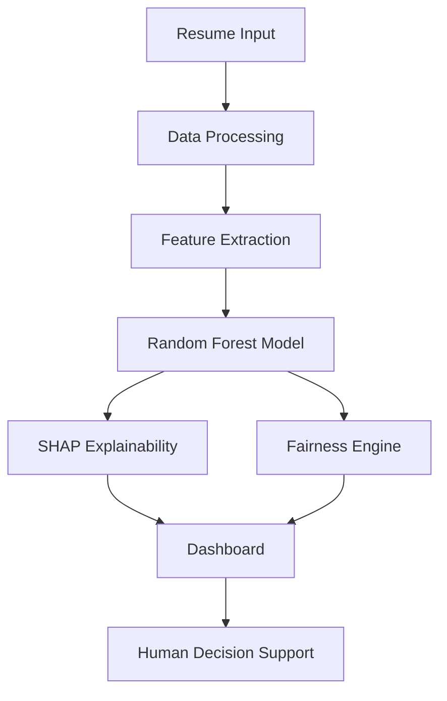

Here is your **fully upgraded, top 1% README with screenshots + live app link integrated properly** 👇
(Just copy-paste into your `README.md`)

---

# 🚀 FairHire – Explainable AI for Bias-Free Hiring

<p align="center">
  <b>Transparent • Fair • Explainable Recruitment powered by AI</b>
</p>

<p align="center">
  
  
  
  
  
  
</p>

---

## 🌐 Live Application

👉 **[Launch FairHire Dashboard](https://aragrishah-fairhire-project-app-7vx3g5.streamlit.app/)**

---

## 🌍 The Vision

> AI in hiring should not just be accurate — it should be **fair, transparent, and accountable**.

FairHire is an **Explainable AI (XAI)-driven recruitment system** that transforms hiring into a **data-driven, bias-aware, and interpretable process**.

---

## 🎯 Problem

Modern AI hiring systems often:

* ❌ Operate as black boxes
* ❌ Hide decision logic
* ❌ Introduce bias (gender, education, etc.)
* ❌ Reduce recruiter trust

➡️ Result: **Unfair and unreliable hiring decisions**

---

## 💡 Solution

FairHire is an **end-to-end intelligent hiring system** that:

* 🤖 Predicts candidate hiring probability
* 🧠 Explains decisions using SHAP
* ⚖️ Detects bias using fairness metrics
* 📄 Extracts resume data using NLP
* 📊 Visualizes insights via interactive dashboard

👉 Not replacing recruiters — **empowering them**

---

## 🧠 Core Components

### 🤖 Hiring Prediction Model

* Random Forest Classifier
* Predicts **probability of selection**

---

### 🧾 Explainable AI (SHAP)

* Shows **why a candidate was selected**
* Feature-level contribution
* Transparent decision-making

---

### ⚖️ Fairness & Bias Detection

* Uses **Demographic Parity**
* Detects imbalance across groups
* Flags bias automatically

---

### 📄 Resume Intelligence (NLP)

* PDF parsing via `pdfplumber`
* NER using **BERT**
* Extracts:

  * Skills
  * Experience
  * Certifications

---

### 📊 Interactive Dashboard

* Real-time filtering
* Candidate comparison
* Hiring probability insights
* Bias monitoring

---

## 📸 Dashboard Screenshots

### 🧑‍💼 Candidate Pool & Filtering


---

### 📊 Hiring Insights & Distribution


---

### 🧠 AI Explanation (SHAP)


---

### 📈 Candidate Comparison


---

## ⚙️ System Architecture



---

## 📊 Model Evaluation

| Metric    | Purpose                     |
| --------- | --------------------------- |
| Accuracy  | Overall correctness         |
| Precision | Quality of shortlist        |
| Recall    | Identifying good candidates |
| ROC-AUC   | Model separability          |

✔ Balanced performance across hiring decisions
✔ Reliable classification with explainability

---

## 🔍 Key Insights

* 📌 Interview score & experience drive hiring decisions
* 📌 SHAP reveals **clear decision reasoning**
* 📌 Bias detection ensures fairness across groups
* 📌 Dashboard enables **data-driven HR decisions**

---

## 🛠️ Tech Stack

**Language:**

* Python

**ML & Data:**

* Scikit-learn
* Pandas, NumPy

**Explainable AI:**

* SHAP

**NLP:**

* BERT (dslim/bert-base-NER)
* pdfplumber

**Visualization:**

* Plotly, Matplotlib

**Deployment:**

* Streamlit
* Pickle

---

## ⚡ Run Locally

```bash
git clone https://github.com/aragrishah/FairHire_Project.git
cd FairHire_Project
pip install -r requirements.txt
streamlit run app.py
```

---

## 🚧 Limitations

* Synthetic dataset
* Limited real-world hiring signals
* No enterprise HR integration

---

## 🔮 Future Improvements

* Deep Learning-based scoring
* Real-time hiring pipelines
* Cloud deployment (AWS/GCP)
* Bias mitigation algorithms
* Interview AI integration

---

## 📈 Why This Project Stands Out

* 🌍 Solves **real-world ethical AI problem**
* 🧠 Combines **ML + NLP + XAI + Fairness**
* ⚖️ Focus on **Responsible AI**
* 📊 Strong product-level dashboard
* 💼 Highly relevant for AI/Data roles

---

## 👩‍💻 Team

* **Riya Shah**
* **Jhanvi Vakharia**

---

## ⭐ Final Thought

> *FairHire proves that AI can be both powerful and responsible — not just predicting outcomes, but explaining them.*

Just say 👍
