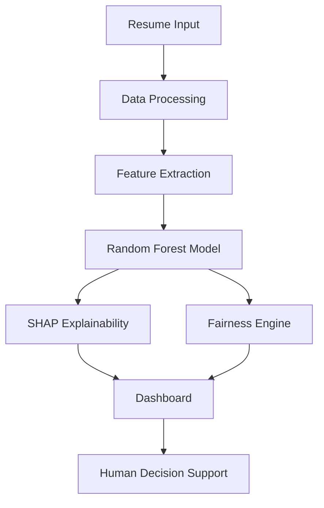

# 🚀 FairHire – Explainable AI for Bias-Free Hiring


---

## 🌍 The Vision

> **AI should not just be accurate — it should be fair, transparent, and accountable.**

FairHire is an **Explainable AI (XAI)-driven recruitment system** that transforms hiring into a **transparent, bias-aware, and data-driven process**.

Unlike traditional “black-box” AI models, FairHire ensures that every hiring decision is:
✔ Explainable
✔ Auditable
✔ Fair

---

## 🎯 Problem

Most AI hiring systems today:

* ❌ Act as **black boxes**
* ❌ Hide decision logic from recruiters
* ❌ Introduce **algorithmic bias** (gender, education, etc.)
* ❌ Reduce trust in automated hiring

This creates **ethical, legal, and practical risks** in recruitment.

---

## 💡 Solution

FairHire is a **decision-support system** that integrates:

* 🤖 Machine Learning (Random Forest)
* 🧠 Explainable AI (SHAP)
* ⚖️ Fairness Auditing (Demographic Parity)
* 📄 NLP Resume Screening (BERT)
* 📊 Interactive HR Analytics Dashboard

It doesn’t replace humans — it **empowers them with transparent insights**.

---

## 🧠 Core Components

### 🤖 Hiring Prediction Model

* Random Forest Classifier
* Predicts **probability of candidate selection**
* Handles structured HR datasets effectively

---

### 🧾 Explainable AI (SHAP)

* Shows **feature contribution for each prediction**
* Provides global + individual interpretability
* Helps recruiters understand *why* a candidate is selected

---

### ⚖️ Fairness & Bias Detection

* Uses **Demographic Parity**
* Detects selection rate differences across groups
* Flags potential bias automatically

---

### 📄 Resume Intelligence (NLP)

* PDF parsing using `pdfplumber`
* Named Entity Recognition via **BERT**
* Extracts:

  * Skills
  * Experience
  * Certifications
* Converts resumes into structured ML input

---

### 📊 HR Analytics Dashboard

* Candidate filtering & comparison
* Hiring probability visualization
* Feature importance insights
* Bias monitoring dashboard

---

## ⚙️ System Architecture



---

## 📊 Model Evaluation

| Metric    | Description                             |
| --------- | --------------------------------------- |
| Accuracy  | Overall prediction correctness          |
| Precision | Correct positive predictions            |
| Recall    | Ability to identify suitable candidates |
| ROC-AUC   | Model separability performance          |

> The model demonstrates **strong classification performance and balanced precision-recall**, ensuring reliable hiring predictions 

---

## 🔍 Key Insights

* 📌 **Interview score & experience** are major decision factors
* 📌 SHAP provides **clear reasoning behind predictions**
* 📌 Fairness engine detects **bias across demographic groups**
* 📌 Resume module enables **real-time candidate evaluation**

---

## 📸 System Preview

### 🧑‍💼 Candidate Filtering & Insights

* Real-time filtering
* Hiring probability distribution
* Decision breakdown

### 📊 SHAP Explainability

* Visual feature contribution
* Positive vs negative impact

### 📈 Candidate Comparison

* Multi-candidate evaluation
* Side-by-side analysis

### 📄 Resume Screening

* Automated parsing
* Instant hiring probability

---

## 🛠️ Tech Stack

**Language:**

* Python

**Machine Learning:**

* Scikit-learn (Random Forest)
* Pandas, NumPy

**Explainable AI:**

* SHAP

**NLP:**

* BERT (dslim/bert-base-NER)
* pdfplumber

**Visualization:**

* Plotly
* Matplotlib

**Deployment:**

* Streamlit
* Pickle

---

## 🚀 Getting Started

```bash
git clone https://github.com/aragrishah/FairHire_Project.git
cd FairHire_Project
pip install -r requirements.txt
streamlit run app.py
```

---

## 🎥 Demo

📌 *Watch the working system:* 
👉 https://drive.google.com/file/d/1q2aPmldaG09KCflBm35vSql0p8vHAXWO/view?usp=drive_link

---

## 📈 Why This Project Stands Out

* 🌍 Solves **real-world ethical AI problem**
* 🧠 Combines **ML + NLP + XAI + Fairness**
* ⚖️ Focus on **responsible AI systems**
* 📊 Strong **data + analytics integration**
* 💼 Highly relevant for **AI / Data / FinTech roles**

---

## 🔑 Keywords (ATS Optimized 🚀)

Explainable AI, Fairness in AI, Bias Detection, HR Analytics,
Machine Learning, Random Forest, SHAP, NLP, BERT,
Ethical AI, Recruitment Automation, Data Science

---

## 🧪 Future Enhancements

* 🔮 Deep Learning-based candidate scoring
* 🌐 Cloud deployment (AWS / GCP)
* 📊 Advanced recruiter dashboards
* 🎯 Real-time bias mitigation techniques
* 🤖 Interview AI integration

---

## 👩‍💻 Team

* **Riya Shah**
* **Jhanvi Vakharia**

---

## ⭐ Final Thought

> *“FairHire proves that AI can be both powerful and responsible — not just predicting outcomes, but explaining them.”*
